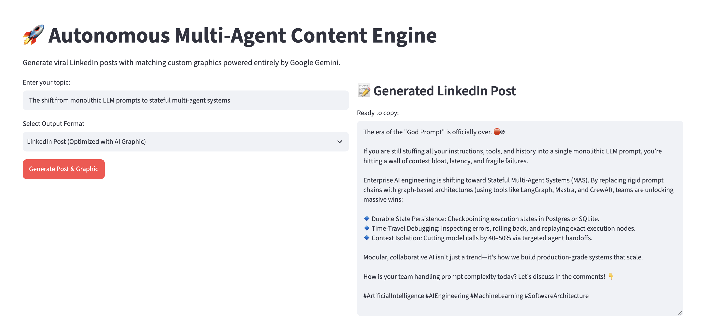

# 🚀 Autonomous Multi-Agent Content Engine

An enterprise-grade, containerized AI microservice and web application that automates end-to-end technical research, editorial fact-checking, content synthesis, and AI image generation using **CrewAI**, **Google Gemini**, **Tavily Search**, **FastAPI**, and **Streamlit**.

---

## 📸 UI Preview
Here is what the Streamlit user interface looks like when running locally:



---

## 📖 About the Project

Writing high-quality technical content, research briefs, or viral social media posts usually requires hours of manual web research, fact-checking, and drafting. 

This project solves that by orchestrating a **multi-agent crew** where specialized autonomous agents collaborate sequentially:
1. **Senior Market Research Analyst:** Scours live web sources via Tavily Search for high-credibility data.
2. **Editorial Quality Controller:** Critically reviews the research for logic flaws, factual accuracy, and missing context.
3. **Technical Content Writer:** Synthesizes the validated findings into your desired output format (Blog Post, Research Brief, Technical Article, or a viral LinkedIn Post paired with an AI-generated graphic).

---

## 🏗️ System Architecture & Workflow

```
[ Streamlit Web UI ] (Port 8501)
       │ (HTTP POST /generate)
       ▼
[ FastAPI Gateway ] (Port 8000)
       │ 
       ▼
[ CrewAI Sequential Pipeline ]
       ├── 1. Senior Market Research Analyst ──> Queries live web via [Tavily Search API]
       ├── 2. Editorial Quality Controller   ──> Evaluates gaps, logic flaws, and validates research
       └── 3. Technical Content Writer       ──> Synthesizes validated notes into publication-ready output
       │
       ▼
[ Google Gemini LLM Runtime ] (gemini-2.5-flash & Image Generation)
```

---

## 📂 Project Structure

```text
content-engine/
├── app/
│   ├── __init__.py        # Package initializer
│   ├── agents.py          # Defines agent roles, backstories, tools, and Gemini models
│   ├── frontend.py        # Streamlit interactive web interface
│   ├── main.py            # FastAPI application server and route definitions
│   └── tasks.py           # Defines sequential tasks and Crew execution logic
├── .env                   # Environment secrets (API keys)
├── Dockerfile             # Multi-stage container build configuration
├── docker-compose.yml     # Multi-container orchestration setup
├── requirements.txt       # Locked project dependencies
└── run_test.py            # Standalone script for direct terminal execution
```

---

## ⚙️ Setup & Installation Instructions

### 1. Clone & Configure Secrets
Clone your repository and create your `.env` file in the project root:
```bash
touch .env
```
Open the `.env` file and add your credentials:
```env
GEMINI_API_KEY=your_actual_gemini_api_key_here
TAVILY_API_KEY=your_actual_tavily_api_key_here
```

### 2. Run via Docker Compose (Recommended)
Make sure **Docker Desktop** is running on your computer, then build and launch the application containers:
```bash
docker-compose up --build
```

### 3. Access the Application
Once running, open your browser to access:
* **Streamlit Web UI:** [http://localhost:8501](http://localhost:8501)
* **FastAPI Backend Documentation:** [http://localhost:8000/docs](http://localhost:8000/docs)

---

## 💡 Example Prompts & Use Cases

You can test these examples directly in the Streamlit web interface across different formats:

### 1. Software Engineering & Architecture
* **Topic:** `The shift from monolithic LLM prompts to stateful multi-agent systems`
* **Format:** `Blog Post`

### 2. Enterprise Technology & FinTech
* **Topic:** `Real-world enterprise adoption barriers of autonomous AI agents in banking`
* **Format:** `Research Brief`

### 3. Cloud Infrastructure
* **Topic:** `Comparing Kubernetes and serverless architectures for high-throughput microservices`
* **Format:** `Technical Article`

### 4. Social Media & Growth
* **Topic:** `Why multi-agent systems are transforming software development workflows`
* **Format:** `LinkedIn Post` *(Generates a punchy, hook-driven post + custom AI Gemini visual graphic)*

---

## 🔮 Future Possibilities
* **State Persistence & Cyclic Graphs:** Upgrading to LangGraph or CrewAI Flows for dynamic self-correction loops.
* **Human-in-the-Loop (HITL):** Adding approval checkpoints for human editors before publication.
* **Enterprise RAG:** Connecting vector databases to query internal company documentation alongside live web data.